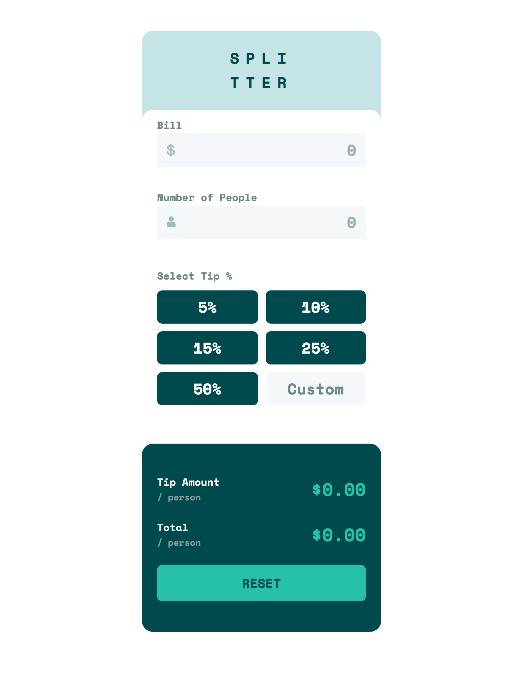
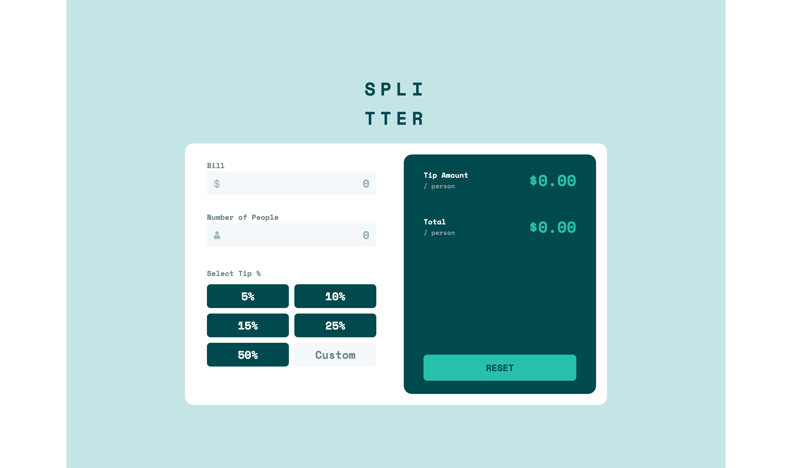

# Frontend Mentor - Tip calculator app solution

This is a solution to the [Tip calculator app challenge on Frontend Mentor](https://www.frontendmentor.io/challenges/tip-calculator-app-ugJNGbJUX).

## Table of contents

- [Overview](#overview)
  - [The challenge](#the-challenge)
  - [Screenshot](#screenshot)
  - [Links](#links)
- [My process](#my-process)
  - [Built with](#built-with)
  - [What I learned](#what-i-learned)
  - [Continued development](#continued-development)
  - [Useful resources](#useful-resources)
- [Author](#author)

## Overview

### The challenge

Users should be able to:

- View the optimal layout for the app depending on their device's screen size
- See hover states for all interactive elements on the page
- Calculate the correct tip and total cost of the bill per person

### Screenshots

### Links

- Solution URL: [Add solution URL here](https://your-solution-url.com)
- Live Site URL: https://chrissoncrant.github.io/tip-calculator-FEM/ 

## My process:

This project was a great challenge. Altogether it took me about 28 hours or so, which means about 2 hours a day over the course of 2 weeks. 

The hardest part for me was creating the Custom button interface. I wanted to ask for help many times in the Slack channel, but powered through it.

The javascript programming wasn't too difficult. Probably the most difficult thing about it was getting the input checking functions working correctly. 

### Built with

- VSCode
- Semantic HTML5 markup
- CSS custom properties
- Flexbox
- CSS Grid
- Mobile-first workflow

### What I learned

#### Importance of UI/UX:
I learned about the importance of UI/UX and how even though I receive a design template if that design template doesn't make sense in regards to UI/UX then it behooves me to make the appropriate adjustments. User experience is everything. 

#### Regular Expressions:
I learned a bit more about regular expressions. These can be confusing, especially if I am not using them on a regular basis, however the amount of time it takes me to "relearn" is less and each time I revisit I learn a bit more. 

In this project I learned more about the difference between RegEx contructors and RegEx literals. I haven't used the contructors before and started messing with them in this project however I ended up going with using literals as I had no need for dynamic searches which I read that is what RegEx constructors are used for. 

I did run into a quirk regarding how RegEx constructors work when a global flag is added. 

#### Bubbling:
While messing with click events and deciding how I was going to code the Custom tip button I ran into some interesting behavior and so I ended up researching into Collapsing and Bubbling. I learned about certain options which are helpful to preventing and manipulating capture and bubble behavior. 

I created a reference project to help me with this when I encounter it again and have forgotten what I learned, which I am sure will be inevitable. 

#### .focus():
This is a useful method that I learned about while trying to make it easier for users to fix input errors. 

#### Write Ugly Code:
I found myself getting stuck trying to make the code as elegant as possible from the get go, but I realized that the best way for me for right now is to write out the code even if there are lots of repetitions as seeing those repetitive lines in front of me help me to better visualize what can be wrapped in a function. 

### Continued development

Things I would like to practice more with: 
- Media Queries
- Accessibility procedures and practices.

### Useful resources

- [Awesome Video about Capturing and Bubbling](https://www.youtube.com/watch?v=F1anRyL37lE)

## Author

- Frontend Mentor - [@chrissoncrant](https://www.frontendmentor.io/profile/chrissoncrant)
- GitHub - [@chrissoncrant](https://github.com/chrissoncrant)